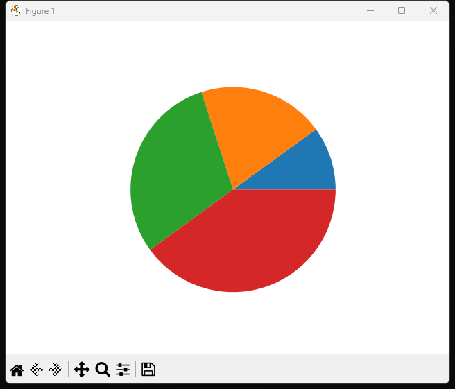

# 第三方库

本章我们要做三个小应用程序：

- 调用C启动一个HTTP服务
- 调用Python画一个图表
- 调用JS画一个canvas图形

HTTP比较复杂，我们先来做最简单的用Python画图表。

## Python

我选取了`matplotlib`这个Python库来画图表。

首先需要安装它：

```bash
$ pip install matplotlib
```

直接使用`matplotlib`，需要调用多个语句，
还需要传送数组之类的参数（用numpy的np.array）。
现在的Z语言还没法做到这一点，因此我写了个简单的封装：

```py
# 饼状图
import matplotlib.pyplot as plt
import numpy as np

def pie(a, b, c, d):
    y = np.array([a, b, c, d])
    plt.pie(y)
    plt.show() 
```

这是一个最简单的饼状图，接收4个参数，分别表示4个块的大小。
之所以用4个参数，是因为现在Z最多支持4个参数。
等以后Z支持数组了，并支持多语句，就可以直接调用`matplotlib`了。

我们把这个封装库放到`lib/py/charts.py`中。
要调用它，需要指定引用这个`charts`库。

于是需要提前实现最简单的`use`导入语句了。

之前用标准库的时候，还可以说因为标准库太常用，不需要明确导入，但这种第三方库就说不过去了。

下面是`use`导入的用法：

```z
use charts.pie

pie(10, 20, 30, 40)
```

要支持`use`语句，我们的需要做3件事：

1. 编译器能处理多条简单语句。当前的编译器总共只处理了一条语句。
1. AST中加上`use`的结构
1. 语法解析时处理`use`，并能生成python中对应的`import`语句

上一节我们已经做完了第一条。

本节来完成剩下两件事。

## `use`语句

现在实现`use`语句是相当简单的，因为我们完全不需要考虑`名字空间`啊、`模块作用域`、`多层模块`啊之类的问题。

`use`只是告诉编译器在生成代码的时候，加一句`include`或`import`导入就行了。

我们现在只实现最简单的`use`，它包含两个信息：

```z
use <box>.<fname>
```

其中`box`是一个模块的名称，也就是我们平时所说的`package`或者`module`，
而`fname`是这个模块中的一个函数名。

对应的，`use`的AST节点应该是这样的：

```c
typedef struct Use Use;
struct Use {
    char *box;
    char *fname;
};
```

再添加一个节点类型`ND_USE`，我们的AST就搞定了。

## 语法解析

首先需要加上一个词符`TK_DOT`，即`.`，用来分隔`box`和`fname`。

然后还要加一个词符`TK_USE`，用来表示`use`关键字。

这是我们用的第一个关键字词符。

关键字和名字词符的形式是一样的，都是字母开头，后面跟着字母。

因为，我们需要先解析出一个名字之后，再判断它是不是关键字。

```c
static Token *name(Lexer *lexer) {
    while (is_alnum(peek(lexer))) {
        next_char(lexer);
    }

    // 返回TK_NAME之前，先查找一下它是否为关键字
    Token *keyword = lookup_keyword(lexer);
    return keyword != NULL ? keyword : new_token(lexer, TK_NAME);
}
```

关键字的匹配，现在采用最简单的办法，就是列出各个关键字，然后逐个对比判断：

```c
typedef struct {
    const char *name;
    TokenKind kind;
} Keyword;

static Keyword keywords[] = {
    {"use", TK_USE},
};

// 查找关键字
// TODO: 现在是顺序对比，以后可以考虑用hash表，或者用trie树
static Token *lookup_keyword(Lexer *lexer) {
    for (int i = 0; i < sizeof(keywords) / sizeof(Keyword); i++) {
        if (strncmp(lexer->start, keywords[i].name, lexer->cur - lexer->start) == 0) {
            return new_token(lexer, keywords[i].kind);
        }
    }
    return NULL;
}
```

这里如果匹配到`"use"`，那么就返回`TK_USE`词符。

接着在解析器里加上对`TK_USE`的处理。
由于`use`语句是关键字开头，后接固定的结构，我们可以把它当做是一种`unary`一元操作，操作符就是`use`关键字。
在`parser.c`中的`unary()`解析函数里添加一个`switch`分支，判断`TK_USE`词符：

```c
// parser.c
static Node *unary(Parser *parser) {
  switch (parser->cur->kind) {
    case TK_USE:
        return use(parser);
    // ...
  }
}
```

具体的解析函数`use()`如下：

```c
static Node *use(Parser *parser) {
    advance(parser); // skip 'use'
    Node *expr = new_node(ND_USE);
    // 解析box
    expr->as.use.box = strip(parser->cur->pos, parser->cur->len);
    advance(parser); // skip box
    if (match(parser, TK_DOT)) { // 解析'.'
        advance(parser); // skip '.'
        // 解析name
        expr->as.use.name = strip(parser->cur->pos, parser->cur->len);
        advance(parser); // skip TK_NAME
    }
    return expr;
}
```

这个逻辑很清晰，分别解析`TK_USE`、`<box>`、`TK_DOT`、`<name>`，
然后组装成一个`ND_USE`节点即可返回。

最后，再加上对应的打印信息功能，就可以通过解释器看到AST的输出了：

```bash
$ xmake run z interp "use charts.pie"
Parsing use charts.pie...
> node: use charts.pie
Parse done.
----- NODE ----
{kind:ND_PROG, exprs: [{kind:ND_USE, box: charts, name: pie}]}
...
```

可以看到，这里得到的节点是`{kind:ND_USE, box: charts, name: pie}`。

## 生成代码

由于我们现在引入`use`只是为了展示对第三方生态的引用，
而且Z现在也没法提供自定义库函数，
所以解释器、编译器暂时都不处理`use`语句。
我们只需要考虑在转译器中，如何把`use`语句变成对应语言的`#include`或`import`语句即可。

在Python中，`use charts.pie`需要转化成`from charts import pie`。
也就是说，转化的规则是： `from <box> import <name>`。

同理，C和JS的转化规则也类似：

- PY： `from <box> import <name>`。
- JS： `import {<name>} from '<box>'`。
- C： `#include <box>.h`。C语言不需要处理`name`，因为它会默认导入模块里的所有名称。

我们先处理Python的转译器后端。

所有需要输出的信息，在`do_meta`里就可以输出了，因此我们只需要在各自对应的`do_meta`代码中处理好输出即可。
另外，由于`use`语句也占了一个语句位置，而我们默认每个语句后会添加一个`\n`或`;\n`，因此在遇到`ND_USE`时，需要跳过。

```c
char *fname_in_use = "";
for (int i = 0; i < prog->as.exprs.count; ++i) {
    Node *expr = prog->as.exprs.list[i];
    if (expr->kind == ND_USE) {
        char *fname = expr->as.use.name;
        if (strcmp(fname, fname_in_use) != 0) {
            fprintf(fp, "from %s import %s\n", expr->as.use.box, expr->as.use.name);
            has_import = true;
        }
        fname_in_use = fname;
    } else if (expr->kind == ND_CALL) {
        char *fname = expr->as.call.fname->as.str;
        if (strcmp(fname, "print") != 0 && strcmp(fname, fname_in_use) != 0) {
            fprintf(fp, "from stdz import *\n", META.uses[i]);
            has_import = true;
        }
    }
}
```

这是`codegen_py`的第一道处理。现在加上对`ND_USE`的判断。

1. 遇到`ND_USE`时，需要输出`from <box> import <name>`。
1. 遇到`ND_USE`时，既然已经输出了导入语句，那么后面在遇到`ND_CALL`是就不需要输出导入`stdz`的语句了。

这个逻辑还有漏洞，例如如果我们即调用了`pie()`，又调用了`read_line()`，就会漏掉对`stdz`的导入。

但是，要完美的修补这个漏洞，需要建立系统的`名字查找`体系，而这个特性是变量、常量、自定义函数所依赖的主要功能。我打算到下一章再来实现它。

暂时我们只考虑最简单的情况，即一个程序只需要一个引用就行了。

JS的逻辑和Python基本一致，这里就不赘述了。

C的逻辑也差不多，但是现在的C的第一道处理是放在`do_meta`里的，请去那里查看。

修改完之后，我们的代码就能正常输出`import`或`#include`语句了。

测试用例`test/use`：

```z
use charts.pie

pie(10, 20, 30, 40)
```

分别得到：

```c
// C
#include "charts.h"
int main(void) {
    pie(10, 20, 30, 40);
    return 0;
}
```

```python
# Python
from charts import pie

pie(10, 20, 30, 40)

```

```js
// js
import {pie} from "./charts"

pie(10, 20, 30, 40)

```

完美！

## 执行

现在生成了Python代码，我们可以利用本节开头写的`charts.py`库来执行它了。

要手动执行它，需要先在环境变量里导入标准库和三方库所在的路径，放在`PYTHONPATH`里。

由于我们在Z标准库那一节已经把`stdz`所在的`lib/py`目录加入环境变量了，现在去查找同目录的`charts.py`也照样能查到。

因此运行完`xmake test`之后，可以这样去执行：

```bash
$ cd test/use
$ python app.py
```

`pyplotlib`会直接弹出一个窗口，展示一张好看的饼状图：



图中四个分块的比例正是我们输入的参数`10, 20, 30, 40`。

当然，这样手动执行还是不够完美，所以我打算实现`z run`命令，直接去执行生成的代码。

我们需要在`z run`后面再加一个参数，表示是当做C、Python还是JS来执行：

```bash
$ z run py pie.z
$ z run js triangle.z
$ z run c http.z
```

大概是这样。

我们在`main.c`里加上对应的处理：

```c
// main.c
else if (strcmp(cmd, "run") == 0) {
    if (argc < 4) {
        help_run();
        return 1;
    }
    run(argv[2], argv[3]);
}
```

而`run()`的实现，我选择最简单的办法，直接调用`system()`函数，执行相应的目标程序：

```c
void run(char *target, char *file) {
    if (strcmp(target, "py") == 0) {
        log_trace("Building %s...\n", file);
        trans_py(file);
        log_trace("\nRunning %s...\n", file);
        system("python app.py");
        return;
    }
    if (strcmp(target, "js") == 0) {
        log_trace("Building %s...\n", file);
        trans_js(file);
        log_trace("\nRunning %s...\n", file);
        system("node app.js");
        return;
    }
    if (strcmp(target, "c") == 0) {
        log_trace("Building %s...\n", file);
        trans_c(file);
#ifdef _WIN32
        system("cl app.c");
        log_trace("\nRunning %s...\n", file);
        system("app.exe");
#else
        system("clang app.c -o app.exe");
        log_trace("\nRunning %s...\n", file);
        system("./app.exe");
#endif
        return;
    }
}
```

注意，由于现在`run`命令并不是很重要，我选择了最简单的办法，直接调用：

- C：先用`cl`或`clang`编译，再执行`app.exe`。
- Python：直接执行`python app.py`。
- JS：直接执行`node app.js`。

要做到这一点，要求系统已经安装好了`cl`（即Visual Studio）或`clang`，以及`python`和`node`。

并且JS的执行明显不对，应当把`app.js`导入一个示例的`html`文件中，再启动一个HTTP服务，再用浏览器打开这个`html`文件。这段操作比较复杂，对于我们的目标来说，暂时也不需要实现，就先不做了。

现在唯一能跑的比较欢快的就是`Python`，我们直接试试`pie.z`的例子：

把`pie.z`放到`work`目录中，然后执行：

```bash
 xmake run -w work z run py pie.z
Hello from Z!
Building pie.z...
Transpiling pie.z to Python
Parsing use charts.pie

pie(10, 20, 30, 40)
...
> node: use charts.pie
Parsing int text: 10
...
Parse done.
----- NODE ----
{kind:ND_PROG, exprs: [{kind:ND_USE, box: charts, name: pie}, { kind:NT_CALL, fname: {kind: ND_FNAME, as.str: pie}, args: {kind: ND_INT, as.num: 10}, {kind: ND_INT, as.num: 20}, {kind: ND_INT, as.num: 30}, {kind: ND_INT, as.num: 40} }]}
----- END ----

Running pie.z...
```

输出一大堆乱七八糟的信息（未来我再清理吧），然后就弹出了饼状图！

成功了！

现在我们可以提交一个新版本了：

```bash
$ git commit -a -m "步骤23：最简单的z run"
$ git tag -a v0.0.23 -m "步骤23：最简单的z run"
$ git push
```


## 小结

花了不少功夫，终于实现了一个简单的第三方库，并且通过`z run`命令直接执行。

我又调研了一番，发现继续做C和JS的第三方库示例，性价比不高：

- 我调研了几个C的第三方HTTP，发现都比较麻烦，或者有授权问题。并没有类似Python的SimpleHTTPServer那样简单的三方库。
- 如果自己找教程写一个最简单的C的HTTP库，再提供一个`http_server(char *host, int port)`的话，倒是可行，但是这个工作的绝大多数功夫都要花在写C代码上，考虑到我11月的目标，肯定来不及了。因此我打算把这个任务放到第5章之后，那时候Z语言有了大部分的基础特性，说不定可以考虑直接用Z通过翻译成C来实现它。
- JS的三方库，本来打算直接调用Canvas画个心形，但发现这个工作和Python调用matplotlib画图的流程没有任何区别，做出来没有意义。
- 后来又找了个更强大的示例，用Three.js画出动态的3D图形。但是发现现在的Z语言还不太支持这种复杂的调用，所以打算等过一两章，Z更加强大了，再来挑战他。

总的来说，我把JS的实例跳票到下个月底；C的实例则要跳票到1月份了。

但回顾一下本章的内容，还是足够充实了。

到时候再用更强大的Z来实现更复杂的JS和C应用，不也有一种微妙的成长感吗？

最后，本来本章还要一“自定义函数”做结尾，我调研之后发现自定义函数的主要任务之一就是处理好参数在函数内部的使用，而这种用法和局部变量的处理非常像。另外，也必须处理好函数内部的作用域，即实现“视野”特性。

这两个特性都适合在做“局部变量”的时候去实现，然后再扩展到函数参数。

因此我打算把“自定义函数”放到下一章的结尾。

既然这几个重活不是跳票、就是挪期了，那我就可以提前打卡下班了：第三章，完成！
